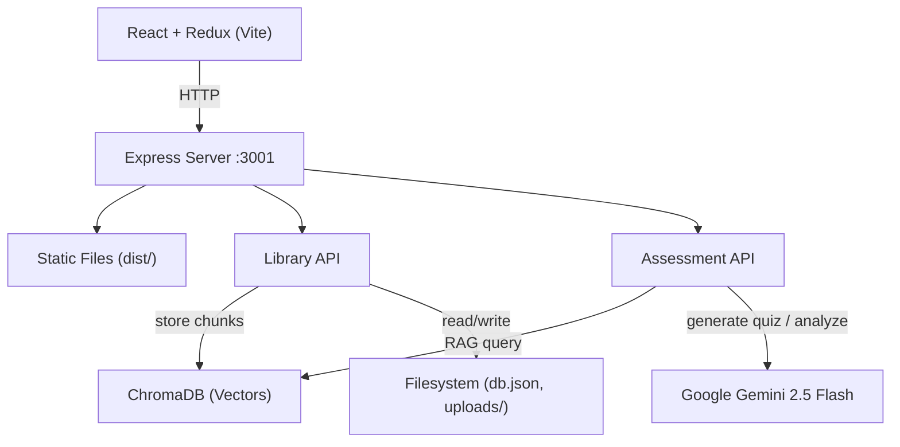

# Bookio

A local-first RAG-powered assessment tool that turns books into quizzes with contextual feedback.

## Architecture



### Request Flow

1. **Upload** — User uploads a book (PDF/TXT) via the React frontend
2. **Ingest** — Text is extracted, split into chapters, and chunked
3. **Embed** — Chunks are embedded and stored in ChromaDB
4. **Quiz** — User requests a quiz; relevant chunks are retrieved (RAG) and sent to Gemini to generate questions
5. **Feedback** — Wrong answers are analyzed by Gemini with relevant book passages for contextual explanations

## Quick Start (Local Development)

### 1. Install dependencies

```bash
cd server && npm install
cd ../client && npm install
```

### 2. Configure environment

```bash
cp .env.example server/.env
# Edit server/.env and add your Gemini API key
```

### 3. Start ChromaDB

```bash
cd server && npx chroma run --path ./chroma-data
```

### 4. Run the app

In two terminals:

```bash
# Terminal 1 — API server
cd server && npm run dev

# Terminal 2 — Frontend
cd client && npm run dev
```

The client runs at **http://localhost:5173** and proxies API requests to the server on port 3001.

## Deploy to Google Cloud VM

### 1. Create a Compute Engine VM

- **Image**: Ubuntu 22.04+ or Debian 12
- **Machine type**: e2-small (2 GB RAM) or e2-micro (1 GB)
- **Disk**: 10 GB
- **Firewall**: Allow HTTP traffic, and create a firewall rule to allow TCP port 3001

### 2. SSH into the VM and set up

```bash
# Install git and Node.js 22
sudo apt-get update -y && sudo apt-get install -y git
curl -fsSL https://deb.nodesource.com/setup_22.x | sudo -E bash -
sudo apt-get install -y nodejs

# Clone and build
git clone https://github.com/kdugue/bookiio.git ~/bookio
cd ~/bookio/server && npm install --production
cd ~/bookio/client && npm install && npm run build

# Configure environment (replace with your actual key)
cat > ~/bookio/server/.env << 'EOF'
GEMINI_API_KEY=your_gemini_api_key_here
PORT=3001
CHROMA_HOST=localhost
CHROMA_PORT=8000
EOF

# Start ChromaDB in background
cd ~/bookio/server && npx chroma run --path ./chroma-data &
sleep 3

# Start the server
node index.js
```

### 3. Ingest a book

In a second SSH session:

```bash
curl -X POST http://localhost:3001/api/v1/library/rave-diet-001/ingest
```

### 4. Access the app

Visit `http://YOUR_VM_EXTERNAL_IP:3001` in your browser.

### Updating after code changes

```bash
cd ~/bookio && git pull && cd client && npm run build
# Restart the server (Ctrl+C in the server terminal, then node index.js)
```

### Useful commands

Remove all non-ready books from the database (run on the VM):

```bash
cd ~/bookio/server
node -e 'const fs=require("fs");const db=JSON.parse(fs.readFileSync("db.json"));db.books=db.books.filter(b=>b.status==="ready");fs.writeFileSync("db.json",JSON.stringify(db,null,2));console.log(db.books.map(b=>b.title))'
```

## Tech Stack

| Layer | Technology |
|-------|-----------|
| Frontend | React, Vite, Redux Toolkit, Tailwind CSS |
| Backend | Node.js, Express |
| Vector DB | ChromaDB (local) |
| LLM | Google Gemini API |
| Persistence | JSON (db.json), filesystem (uploads/) |
